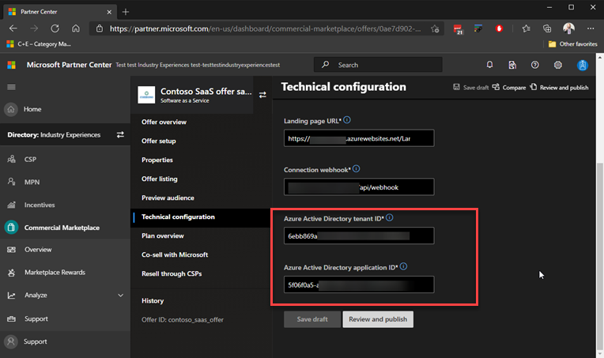
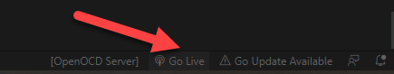
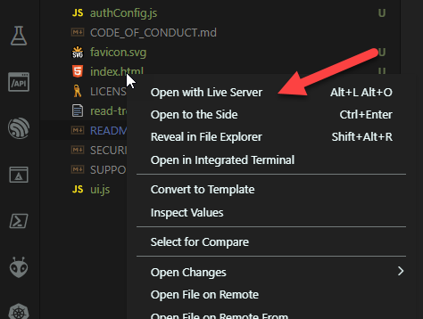
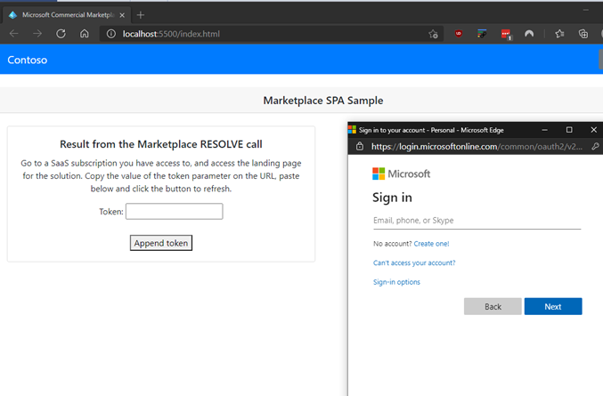
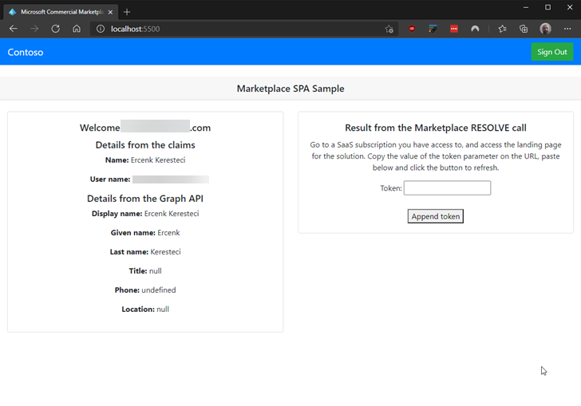
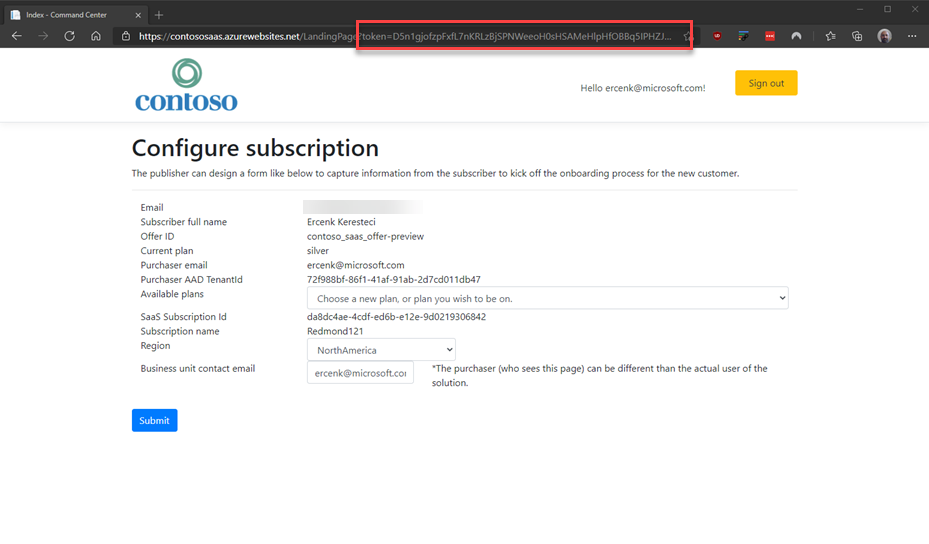
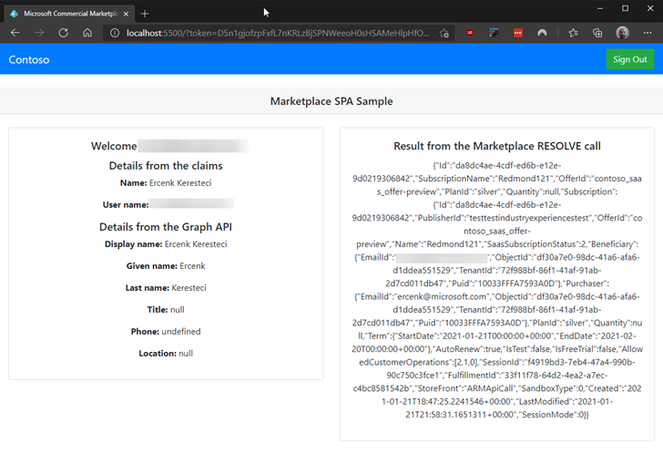

# Single Page Application (SPA) sample demonstrating integration with Microsoft Commercial Marketplace for a SaaS offer

- [Single Page Application (SPA) sample demonstrating integration with Microsoft Commercial Marketplace for a SaaS offer](#single-page-application-spa-sample-demonstrating-integration-with-microsoft-commercial-marketplace-for-a-saas-offer)
  - [Installing and getting it running](#installing-and-getting-it-running)
    - [Prerequisites](#prerequisites)
  - [Running locally](#running-locally)
  - [Contributing](#contributing)
  - [Trademarks](#trademarks)
  
This sample addresses a very narrow case to demonstrate the following. It is **designed to run locally** to demonstrate the AAD SSO on the client side, with a server side component calling the APIs.
- How to sign on a user on the landing page with Azure Active Directory, as requested by the [policy](https://docs.microsoft.com/en-us/legal/marketplace/certification-policies#10003-authentication-options).  
- Using Microsoft Graph or existing claims to get user's contact details.
- Calling the APIs from an Azure Function on the server side and returning result.
- Using [Microsoft Commercial Marketplace C# client](https://github.com/microsoft/commercial-marketplace-client-dotnet) source code.

**This sample is not**

- A best practices blueprint for calling back end APIs (the solution's API endpoint is not secured, please use your own method to secure it.)
- No store for other secrets, e.g. client secret while getting the access token for using the fulfillment API client.
- Intended to be deployed to Azure.

## Installing and getting it running

The sample assumes you have a SaaS offer published on Microsoft Commercial Marketplace, preferably in preview mode, so you can test. You do not have to change the landing page designation, we can use the "token" parameter on the landing page URL to demonstrate the concept.

### Prerequisites

Solution is developed and tested on [Visual Studio Code](https://code.visualstudio.com/).

[Azure Tools for Visual Studio Code extension](https://marketplace.visualstudio.com/items?itemName=ms-vscode.vscode-node-azure-pack) helps you to publish the static Web App and the function app. Make sure you have the [Azure Functions for Visual Studio code](https://marketplace.visualstudio.com/items?itemName=ms-azuretools.vscode-azurefunctions) is also installed. It should be installed as a part of the Azure Tools extensions. 

After you clone the repo, make sure the API builds by typing ```dotnet build``` in the "api/ContosoAPI" folder.. It has a copy of the C# client library, and if you wish to make use of the latest version of the client, the file ["read-tree.txt"](./read-tree.txt) provides an example for how to point to a subtree within a GitHub repo and use a copy of it.

To run locally, use [Visual Studio Code extension, Live Server](https://marketplace.visualstudio.com/items?itemName=ritwickdey.LiveServer). Please note the settings in the ```settings.json``` file in the ```.vscode``` folder to make sure the page is served from ```localhost``` not ```127.0.0.1``` because the SPA settings for the AAD App Registration does not allow ```127.0.0.1```.

## Running locally

Make a new AAD App Registration for SPA for logging on the buying users. It has to be a multi-tenant app registration with "Accounts in an organizational directory" settings. You can use [this](https://docs.microsoft.com/en-us/azure/active-directory/develop/quickstart-register-app) guide to register the app. After registering, add a redirect URI as http://localhost:5500/ by adding a "Single-page application".

Modify the ```clientId``` settings in the [authConfig.js](./authConfig.js) file with the new app registration's App ID (Client Id).

Also use ```dotnet user-secrets``` commands to add three secrets below verbatim. Please see the line calling the constructor ```ClientSecretCredential``` in the file [ResolveSubscription.cs](./api/ContsoAPI/ResolveSubscription.cs). You must use the app registration details you added on the Partner Center's technical details page.

- TenantId
- AppId
- ClientSecret



Run Virtual server either by clicking the "Go Live" button on the Visual Studio Code window's status bar.



or right click on ```index.html``` and select "Open with Live Server"



This will open a new browser tab, and will prompt you to login. Login with any Azure Active Directory or Microsoft Account.



This will log you in, and will bring in your full name from the Graph API, or the claims contained in the received identity token on the left pane.



Notice Graph API brings in different details for Azure Active Directory accounts vs. Microsoft Accounts. 

Now go and access the landing page for a SaaS subscription, and copy the value of the "token" URL parameter.



Then paste it in the "Token" input field of the index page, then select "append token".

This should call the backend API with the token paramater, which in turn will call the Marketplace resolve API. Once all succeeds, it should show the raw result of the resolve call.



## Contributing

This project welcomes contributions and suggestions.  Most contributions require you to agree to a
Contributor License Agreement (CLA) declaring that you have the right to, and actually do, grant us
the rights to use your contribution. For details, visit https://cla.opensource.microsoft.com.

When you submit a pull request, a CLA bot will automatically determine whether you need to provide
a CLA and decorate the PR appropriately (e.g., status check, comment). Simply follow the instructions
provided by the bot. You will only need to do this once across all repos using our CLA.

This project has adopted the [Microsoft Open Source Code of Conduct](https://opensource.microsoft.com/codeofconduct/).
For more information see the [Code of Conduct FAQ](https://opensource.microsoft.com/codeofconduct/faq/) or
contact [opencode@microsoft.com](mailto:opencode@microsoft.com) with any additional questions or comments.

## Trademarks

This project may contain trademarks or logos for projects, products, or services. Authorized use of Microsoft 
trademarks or logos is subject to and must follow 
[Microsoft's Trademark & Brand Guidelines](https://www.microsoft.com/en-us/legal/intellectualproperty/trademarks/usage/general).
Use of Microsoft trademarks or logos in modified versions of this project must not cause confusion or imply Microsoft sponsorship.
Any use of third-party trademarks or logos are subject to those third-party's policies.
